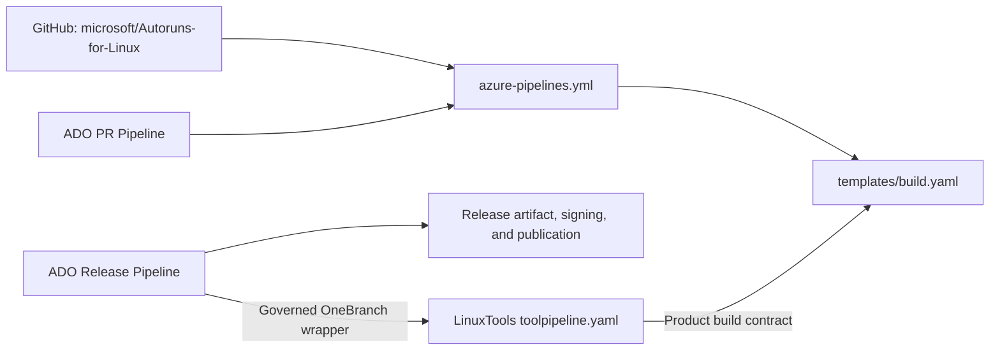

# Azure DevOps Pipeline Creation Plan

Last updated: 2026-08-25

## Purpose

This document is the implementation tracker for creating the Azure DevOps
(ADO) pipelines for Sysinternals Autoruns for Linux. Update the status in the
task tables as work is completed, and add a dated entry to the change log for
every status change or material design decision.

For the investigation narrative, verified evidence paths, important session
decisions, Windows-host continuation workflow, and ready-to-use continuation
prompt, also read `docs/ado-pipeline-session-handoff.md`.

The implementation follows the pattern used by
[`microsoft/Sysinternals-jcd`](https://github.com/microsoft/Sysinternals-jcd):

1. A GitHub-owned PR/CI pipeline reads `azure-pipelines.yml` from the product
   repository.
2. The thin top-level YAML delegates the actual Rust build to
   `templates/build.yaml`.
3. A separately managed ADO release-build pipeline does not use the
  repository's `azure-pipelines.yml`. The JCD reference extends the governed
  OneBranch cross-platform template and delegates product builds and packaging
  to the shared LinuxTools `toolpipeline.yaml` template. Its orchestration and
  checkout and Rust build/package contracts are verified. Autoruns must add
  the repository inputs required by that contract before its release-build
  wrapper can run.

## Status Legend

| Status | Meaning |
| --- | --- |
| Not started | No implementation work has begun. |
| In progress | Work has begun but the acceptance criteria are not met. |
| Blocked | Work cannot proceed until the listed dependency or decision is resolved. |
| Ready for validation | Implementation is complete but has not passed all required checks. |
| Complete | Implementation and validation are complete. |
| Not applicable | The task was reviewed and intentionally excluded. |

## Current Summary

| Area | Status | Current state |
| --- | --- | --- |
| Repository build template | Complete | `templates/build.yaml` builds, formats, lints, and tests the Rust project. |
| Rust toolchain pin | Complete | `rust-toolchain.toml` pins Rust 1.97.1 with `rustfmt` and `clippy`. |
| Repository pipeline entry point | In progress | The YAML exists, but it is temporarily scoped to `initial-rust-implementation` and has PR triggers disabled. |
| ADO/GitHub service connection | Not started | The existing `sysinternals` connection must be verified for this repository. |
| ADO PR pipeline | Not started | The pipeline definition has not been created in ADO. |
| ADO release pipeline | In progress | The JCD Release-Build YAML and OneBranch/LinuxTools structure are identified; shared-template internals and the corresponding Release definition remain to be inspected. |
| Release artifacts and packaging | Not started | The template produces a release binary but does not stage, sign, package, or publish it. |
| End-to-end validation | Not started | Requires both ADO definitions and an upstream GitHub branch/PR. |

## Current Repository Assets

### `azure-pipelines.yml`

The repository contains a thin pipeline that:

- Uses the `ubuntu-24.04` Microsoft-hosted image.
- Checks out `self` so a PR build tests the commit or synthetic merge commit
  selected by ADO.
- Invokes `templates/build.yaml` with `srcPath: '.'`.
- Currently triggers only for pushes to `initial-rust-implementation`.
- Currently declares `pr: none`.
- Currently sets `persistCredentials: true`, although no build step needs to
  push or perform another authenticated Git operation.

This development-only trigger configuration must not be used as the final
upstream PR configuration.

### `templates/build.yaml`

The reusable steps template currently accepts:

| Parameter | Type | Default | Purpose |
| --- | --- | --- | --- |
| `srcPath` | string | `.` | Directory containing `Cargo.toml`. |
| `runStaticAnalysis` | boolean | `true` | Controls formatting and Clippy checks. |
| `ldpath` | string | empty | Optional prefix for `LD_LIBRARY_PATH`. |

It performs the following work:

1. Verifies that `rustup`, `cargo`, and `rustc` are available.
2. Prints the active Rust and Cargo versions.
3. Runs `cargo build --release`.
4. When static analysis is enabled, runs `cargo fmt --all -- --check`.
5. When static analysis is enabled, runs
   `cargo clippy --all-targets -- -D warnings`.
6. Runs `cargo test --all`.

The template currently does not package, sign, stage, or publish the resulting
`target/release/autoruns` binary.

### `rust-toolchain.toml`

The repository pins:

- Toolchain: Rust `1.97.1`
- Profile: `minimal`
- Components: `rustfmt`, `clippy`

Both ADO pipelines must honor this file rather than selecting an independent
floating Rust toolchain.

## Target Architecture



| Pipeline | Definition owner | Trigger | Build implementation |
| --- | --- | --- | --- |
| PR validation | GitHub repository | PRs targeting `main`, plus any agreed CI branches | `azure-pipelines.yml` includes `templates/build.yaml` |
| Release build | ADO-managed definition | Manual or approved build flow (`trigger: none` in JCD) | OneBranch wrapper calls `toolpipeline.yaml@LinuxTools`, which integrates the product build and packaging flow |
| EV2 release | ADO-managed definition | Manual approved deployment (`trigger: none` in JCD) | OneBranch wrapper calls `releaseev2stages.yaml@LinuxTools` and consumes the Release-Build pipeline ID |
| Post-release | ADO-managed definition, only if required | Manual (`trigger: none` in JCD) | JCD currently has only a disabled scaffold; do not create for Autoruns without an active publication requirement |

The release-build pipeline must not call or queue the PR pipeline. The PR
definition includes the product build template directly; the governed
release-build flow reaches the same product template through LinuxTools and
then invokes the product packaging script. That full Rust path is now verified.

## Verified JCD Release-Build Reference

The `jcd-for-Linux-Release-Build-Prod` ADO definition is backed by:

- ADO repository: `Tools/jcd`
- Branch: `main`
- YAML path: `/jcd-for-Linux-Build.yml`
- Trigger: `none`
- Governed template:
  `v2/OneBranch.Official.CrossPlat.yml@OneBranch.Pipelines/GovernedTemplates`
- Shared build/package template:
  `CommonPipelineYAML/toolpipeline.yaml@Tools/LinuxTools`
- Common variable group: `Linux build and release common variables`
- GitHub resource: `Microsoft/sysinternals-jcd` through the `sysinternals`
  endpoint
- Redundant ADO resource alias `jcdADO`: `Tools/jcd` at `refs/heads/main`; the
  observed Linux build obtains support files from pipeline `self`, not this
  alias

The wrapper sets the following product-level values:

- `toolName: jcd`
- `language: rust`
- `version: $(Version)`
- `releaseFilePath: release/jcd-release-repos.json`
- OneBranch Linux ESRP signing enabled
- TSA disabled
- PolicyCheck configured to break the build

JCD's Linux build matrix contains Debian, Rocky Linux, and Azure Linux, each
for AMD64 and ARM64. Debian emits `deb`; Rocky and Azure Linux emit `rpm`.
Each variant supplies a build image, output directory, prerequisite script,
source path, distro type, package type, signing keycode, and (for ARM64) target
and host architecture. The wrapper also enables a signed macOS build, but
Autoruns for Linux should not copy the macOS configuration unless product scope
is expanded explicitly.

This evidence confirms that the correct starting point is an Autoruns-specific
YAML file in an ADO repository, modeled on the JCD wrapper. The LinuxTools
product-build interface is now known. Release JSON schema and the behavior of
the corresponding JCD Release and Post-Release definitions remain unresolved.

### Verified LinuxTools Orchestrator Contract

`CommonPipelineYAML/toolpipeline.yaml` is a generic build, sign, and release
artifact orchestrator. The product wrapper supplies the product identity and a
build matrix; shared templates own the execution details.

Required top-level parameters are:

| Parameter | Purpose |
| --- | --- |
| `version` | Version passed through build, package, macOS, and EV2 jobs. |
| `toolName` | Controls stage/job names, artifact names, metadata lookup, and output naming. |
| `builds` | Per-distribution build/package/signing matrix. |

Relevant optional parameters include:

| Parameter | Default | Autoruns expectation |
| --- | --- | --- |
| `language` | `cpp` | Set to `rust`. |
| `runStaticAnalysis` | `false` | Decide whether release builds repeat formatting and Clippy checks. |
| `releaseFilePath` | Product release JSON path | Point to the Autoruns ADO release metadata file. |
| `publishRepoId` | empty | Determine from the JCD release metadata/publishing flow. |
| `enableMacBuild` | `false` | Keep `false` for Autoruns for Linux. |
| `useSysinternalsEBPF` | `false` | Keep `false`; Autoruns does not use Sysinternals eBPF. |
| `includeDevLib` | `false` | Keep `false`; Autoruns produces a CLI binary, not a development library. |

For every `builds` entry, the orchestrator calls `buildwrap.yaml` with:

- Distribution name and container image
- Output directory and prerequisite script
- Product source path and build directory
- Distribution and package types
- Optional library path
- Target and host architecture
- Language and static-analysis setting

The orchestrator then creates `Sign_<toolName>`. Its Linux signing job:

1. Downloads each `<toolName>_<distroType>` pipeline artifact.
2. Calls `codesign.yaml` for each package type and signing keycode.
3. Copies signed packages to the governed `out` directory, excluding optional
  development-library content.

In parallel, `copyreleasemetadata.yaml` copies product release metadata. After
signing and metadata are available, `genev2artifacts.yaml` creates the EV2
release artifacts. Therefore, Autoruns should integrate with these shared
outputs instead of adding an independent `PublishPipelineArtifact` path unless
the LinuxTools contract proves insufficient.

The remaining controlling inputs are:

1. `CommonPipelineYAML/copyreleasemetadata.yaml`
2. `CommonPipelineYAML/genev2artifacts.yaml`
3. `CommonPipelineYAML/releaseev2stages.yaml`
4. The supported Microsoft Rust channel for new Sysinternals tools
5. The approved Autoruns package destinations and signing keycodes
6. The final Autoruns Release-Build pipeline ID and service-tree identity

### Verified LinuxTools Build Wrapper Contract

`CommonPipelineYAML/buildwrap.yaml` creates one governed OneBranch job for each
entry in the build matrix. It establishes these requirements:

- The GitHub repository resource alias must exactly match `toolName`, because
  the first step is `checkout: ${{ parameters.toolName }}`. For Autoruns, both
  values should therefore be `autoruns`.
- Each job uses a OneBranch Linux pool and sets `LinuxContainerImage` from the
  build entry. ARM64 entries additionally set `hostArchitecture: arm64`.
- The governed output contract is configured through
  `ob_outputDirectory: $(Build.SourcesDirectory)/out` and
  `ob_artifactBaseName: <toolName>_<distroType>`.
- `ToolVersion` receives the wrapper's `version` value.
- `onebranch.pipeline.version@1` assigns a revision-counter build number.
- `install-pre-reqs.yaml@LinuxTools` runs the per-build prerequisite script
  supplied by the product wrapper.
- The actual product build and packaging are delegated to
  `build.yaml@LinuxTools`, not directly to the product repository template.

LinuxTools `build.yaml` receives `distroType`, `packageType`, `builddir`,
`outdir`, `srcPath`, `runStaticAnalysis`, `repo`, `ldpath`, `architecture`, and
`language`, plus optional development-library parameters. For Autoruns,
`repo` will be `autoruns` and `language` will be `rust`.

This confirms that the shared release flow does not directly invoke
`templates/build.yaml` from the GitHub repository at the wrapper level.

### Verified LinuxTools Rust Build and Packaging Contract

`CommonPipelineYAML/build.yaml` resolves the remaining product-build boundary.
When `language: rust`, it performs this sequence:

1. Installs Rust using `RustInstaller@1` from the Sysinternals
   `Tools_PublicPackages` feed.
2. Runs `CargoAuthenticate@0` against `.cargo/config.toml`.
3. Prints glibc and Cargo versions.
4. Includes `templates/build.yaml@<repo>` and passes `srcPath`,
   `runStaticAnalysis`, `builddir`, and `ldpath`.
5. Calls the product repository's `makePackages.sh` once for each matrix entry.
6. Copies resulting `.deb` or `.rpm` files from the product build directory to
   the configured governed output directory.

For RPM builds, LinuxTools runs:

```bash
./makePackages.sh "$(pwd)" target/release <repo> $(VERSION) 0 rpm "$(rpm --eval '%_arch')"
```

For Debian builds, LinuxTools runs:

```bash
./makePackages.sh . target/release <repo> $(VERSION) 0 deb "$(dpkg --print-architecture)"
```

`install-pre-reqs.yaml` simply marks the caller-supplied script executable and
runs it from the workspace root. Therefore, each path in the Autoruns build
matrix must exist in the ADO pipeline-definition repository used as `self` and
be safe to execute inside its selected container image.

The local Autoruns repository currently does not satisfy four parts of this
contract:

- `templates/build.yaml` does not declare the `builddir` parameter that
  LinuxTools always passes. Azure template expansion would reject the call.
- No `makePackages.sh` exists, so both Rust package steps would fail.
- No `build/install-*-dependencies.sh` scripts exist, so prerequisite
  installation would fail.
- No `.cargo/config.toml` exists. The exact location expected by
  `CargoAuthenticate@0` must be confirmed against JCD's checkout layout before
  adding it; an empty or unnecessary authenticated-feed configuration should
  not be invented.

The repository's pinned `rust-toolchain.toml` must also be tested with
`RustInstaller@1`. The release job must install or expose `rustup`, `cargo`, and
`rustc` in a way compatible with the existing product build template.

### Verified JCD Package Inputs and Repository Discrepancy

JCD's public `main` branch contains `makePackages.sh` and these package metadata
templates:

- `dist/DEBIAN.in/control.in`
- `dist/DEBIAN.in/postinst.in`
- `dist/SPECS.in/spec.in`

The packaging script is not generic despite accepting a package-name argument.
Its Debian and RPM branches copy the `jcd` binary and `jcd_function.sh`
explicitly. An Autoruns implementation must adapt the script to package only
the `autoruns` executable and must not retain JCD's shell integration,
post-install messaging, descriptions, URLs, or installed-file lists.

The Debian flow substitutes version and architecture into `control.in`, stages
files under `/usr/bin`, and runs `dpkg-deb`. The RPM flow substitutes version
into `spec.in`, stages files for `rpmbuild`, and copies the architecture-specific
RPM. Autoruns therefore needs product-specific Debian control and RPM spec
metadata in addition to the packaging script.

The public JCD GitHub `main` tree does **not** contain:

- `build/install-ubuntu-dependencies.sh`
- `build/install-rocky-dependencies.sh`
- `build/install-mariner-dependencies.sh`
- `.cargo/config.toml`

These are nevertheless referenced by the supplied ADO Release-Build YAML and
LinuxTools templates. A downloaded log from run `27267` (pipeline definition
`673`, 2026-06-25) resolves their source-control owner: the auto-injected
`sdl_sources` job checked out the ADO repository
`https://dev.azure.com/sysinternals/Tools/_git/jcd`, `main` commit
`450f18795aa5997ee257b110f614e36fa4a67810` ("Merged PR 3610: Add more CFS
mirrors"), into `D:\a\_work\1\s`. PolicyCheck enumerated these files there:

- `.cargo/config.toml`
- `build/install-ubuntu-dependencies.sh`
- `build/install-rocky-dependencies.sh`
- `build/install-mariner-dependencies.sh`
- `release/jcd-release-repos.json`

The supplied `Tools/jcd` checkout at commit
`b76e93dbd7eb339d66dbb9bbb18d774f9a8d2524` provides the exact support-file
contents. Its apparent working-tree modifications to the scripts and release
JSON are line-ending-only and do not change their semantics.

The root `.cargo/config.toml` replaces crates.io with the authenticated sparse
registry `Tools_PublicPackages`:

```toml
[source.crates-io]
replace-with = 'ms-crates-io'

[registries.ms-crates-io]
index = "sparse+https://pkgs.dev.azure.com/sysinternals/_packaging/Tools_PublicPackages/Cargo/index/"
```

This configuration is required by the governed CFSClean environment even when
Autoruns has no private Rust dependencies: public crates must resolve through
the approved centralized feed. The Autoruns ADO definition repository should
use the same non-secret source replacement; credentials remain supplied by
`CargoAuthenticate@0`.

The three JCD prerequisite scripts are baselines, not files to copy unchanged:

- Ubuntu/Debian configures noninteractive APT, uses the approved Debian mirror,
  installs build and packaging tools, downloads `debbuild`, and installs .NET 8.
- Rocky pins Rocky and EPEL to official CDN endpoints for network-isolation
  compliance, then installs RPM/build, eBPF, diagnostic, and .NET 6 tooling.
- Mariner/Azure Linux installs RPM/build, eBPF, diagnostic, and .NET 6 tooling,
  downloads a standalone `jq`, and also installs standard Rust via public
  `rustup` despite the preceding governed `RustInstaller@1` step.

Autoruns should retain only dependencies demonstrated by its Cargo build,
package creation, and LinuxTools signing flow. In particular, do not inherit
JCD's eBPF, stress, debugger, network-diagnostic, or duplicate Rust setup unless
a failing governed build demonstrates a need. Public downloads in the JCD
scripts must also be checked against the current network-isolation policy.

### Verified Release and Post-Release Definitions

`jcd-for-Linux-Release-Ev2.yml` is a second, manually triggered OneBranch
definition. It calls `CommonPipelineYAML/releaseev2stages.yaml@LinuxTools` with
`toolName: jcd` and build `pipelineId: 673`, using a Windows EV2 release image
and a managed SDP rollout with a 24-hour validation override. This confirms
that Release-Build and Release are separate pipeline definitions: the first
creates, signs, and publishes release artifacts; the second deploys artifacts
from the selected build pipeline through EV2.

`jcd-for-Linux-Post-Release.yml` is also manually triggered and checks out the
GitHub product repository in a governed Linux job. However, its
`postreleasesteps.yaml@LinuxTools` call is commented out, so the current file
performs no post-release publishing work. Its commented contract would pass
the tool name, build pipeline ID, release-repository JSON, nested source
directory, repository name, and Mac pipeline ID. Autoruns should not create a
Post-Release definition until that workflow is re-enabled and required by the
release owner.

The current JCD release JSON is a repository-publication mapping, not general
build metadata. It contains five YUM destinations for Fedora 43, openSUSE 15,
and SLES 15, mapping signed Rocky 8 x86_64/ARM64 JCD RPM paths and substituting
`{VERSION}`. It contains no Debian or Azure Linux destinations. Autoruns needs
an approved product-specific destination list; JCD repository IDs and package
paths must not be copied.

The same checkout also contained `jcd-for-Linux-Build.yml`,
`jcd-for-Linux-Release-Ev2.yml`, and `jcd-for-Linux-Post-Release.yml`. This
confirms that build/release metadata and support scripts are ADO-owned rather
than stored in public GitHub `main`.

The Debian job log from the same run resolves the runtime layout completely:

1. OneBranch first checks out the pipeline's `self` repository, `Tools/jcd`
  commit `450f18795aa5997ee257b110f614e36fa4a67810`, at workspace root
  `/mnt/vss/_work/1/s` (container path `/__w/1/s`).
2. `buildwrap.yaml` then checks out the GitHub resource
  `Microsoft/sysinternals-jcd` commit
  `311352c56faa1d49acb87dc7ffedfe7ae9ae553b` into the nested directory
  `/mnt/vss/_work/1/s/sysinternals-jcd`.
3. Relative support paths such as `./build/install-ubuntu-dependencies.sh` and
  `.cargo/config.toml` resolve from ADO `self` at the workspace root.
4. Product `srcPath: sysinternals-jcd` points into the nested GitHub checkout.
5. The product template builds at `/__w/1/s/sysinternals-jcd`; the package helper
  produces `target/release/deb/jcd_0.0.0_amd64.deb`.
6. LinuxTools copies the package to `/mnt/vss/_work/1/s/out/debian_11`, and
  OneBranch publishes `/mnt/vss/_work/1/s/out` as artifact `jcd_debian_11`.

This establishes the required Autoruns ownership split:

- An ADO `Tools/<autoruns-definition-repo>` repository must be pipeline `self`
  and own governed YAML, `.cargo/config.toml`, distro prerequisite scripts,
  release metadata, and the root toolchain configuration used by
  `RustInstaller@1`.
- GitHub `Microsoft/Autoruns-for-Linux` must be a repository resource with alias
  `autoruns`; its default nested checkout directory is expected to be
  `Autoruns-for-Linux`, which must be confirmed in the first test run.
- GitHub owns the product build template, `makePackages.sh`, and Debian/RPM
  package metadata.

The Debian run also exposes a toolchain compatibility issue. `RustInstaller@1`
found the ADO-root `rust-toolchain.toml`, overrode it with Microsoft toolchain
`ms-prod-1.86`, and installed Cargo `1.86.0` through `msrustup`. JCD's product
template only calls Cargo, so that succeeds. Autoruns' current product template
requires the standard `rustup` executable and uses it to install components;
that assumption is not demonstrated in the governed release container. The ADO
root toolchain file, Autoruns' nested `rust-toolchain.toml`, and the product
template must be aligned to one supported Microsoft Rust series before release
builds are enabled.

## Detailed Task Tracker

### 1. Confirm JCD and ADO Conventions

| ID | Task | Status | Completion evidence / notes |
| --- | --- | --- | --- |
| ADO-01 | Open the JCD pipelines under the `OneBranch` folder and record their exact names, folder, owners, permissions, retention, and agent pools. | In progress | `jcd-for-Linux-Release-Build-Prod` YAML ownership is recorded. Release, Post-Release, permissions, retention, and effective pools remain. |
| ADO-02 | Determine which JCD definition is the direct reference for the requested Autoruns release pipeline. | In progress | Release-Build is confirmed as the governed build/package reference. Inspect the corresponding Release definition to settle whether Autoruns needs it as a separate pipeline. |
| ADO-03 | Determine whether Autoruns also requires a separate post-release pipeline. | Not started | The current request describes two pipelines, while JCD displays three production release-related definitions. |
| ADO-04 | Inspect the selected JCD release definition and record how its ADO-only YAML/configuration is stored. | Complete | Release-Build uses `Tools/jcd`, branch `main`, path `/jcd-for-Linux-Build.yml`; it extends governed OneBranch and LinuxTools templates. |
| ADO-05 | Record JCD variable groups, environments, approvals, signing configuration, security scans, artifact tasks, and release branch/tag selection. | In progress | Known: common Linux variable group, Linux ESRP signing, PGP keycodes, TSA disabled, PolicyCheck break enabled, six Linux package builds, signed package collection, release metadata copy, and EV2 generation. Environments, approvals, retention, release definition, and source-ref handling remain. |
| ADO-06 | Agree on Autoruns pipeline names and folder. | Not started | Proposed starting names: `autoruns-for-Linux-PR` and `autoruns-for-Linux-Release-Build-Prod`; use the actual Sysinternals convention. |
| ADO-07 | Inspect a successful JCD Release-Build run's resources and checkout logs. | Complete | Run 27267 Debian log confirms ADO `self` at `/__w/1/s`, GitHub nested at `/__w/1/s/sysinternals-jcd`, support/config paths from ADO root, product paths from GitHub, and artifact `jcd_debian_11` from root `out`. |

### 2. Verify Permissions and Connections

| ID | Task | Status | Completion evidence / notes |
| --- | --- | --- | --- |
| CONN-01 | Verify that the `sysinternals` GitHub service connection exists in the `sysinternals/Tools` ADO project. | Not started | Prefer the Azure Pipelines GitHub App connection used by JCD. |
| CONN-02 | Verify that the connection can read `microsoft/Autoruns-for-Linux` and post GitHub Checks. | Not started | The repository must be included in the GitHub App installation. |
| CONN-03 | Authorize the PR and release pipeline definitions to use the service connection. | Not started | Use per-pipeline authorization unless project policy grants broader access. |
| CONN-04 | Verify permission to create pipelines and place them in the selected ADO folder. | Not started | Requires the ADO `Create build pipeline` permission. |
| CONN-05 | Verify availability of Microsoft-hosted `ubuntu-24.04` agents and parallel-job capacity. | Not started | Required by the current repository YAML. |
| CONN-06 | Confirm the GitHub repository is mapped to the intended ADO organization for automatic CI/PR events. | Not started | A GitHub App repository can automatically trigger pipelines in only one ADO organization. `/azp where` can help diagnose the mapping. |

### 3. Productionize the GitHub Pipeline Entry Point

| ID | Task | Status | Completion evidence / notes |
| --- | --- | --- | --- |
| REPO-01 | Replace the temporary `initial-rust-implementation` trigger with the approved production trigger policy. | Not started | JCD parity would include `main` and `release/*`. A PR-only policy would use `trigger: none`. |
| REPO-02 | Replace `pr: none` with PR validation for PRs targeting `main`. | Not started | Recommended: `autoCancel: true`; decide whether drafts should run. |
| REPO-03 | Retain `checkout: self` for the PR pipeline. | Complete | This ensures PR validation builds the GitHub PR merge ref under review. |
| REPO-04 | Remove `persistCredentials: true` unless a documented step needs authenticated Git access after checkout. | Not started | Least-privilege hardening. |
| REPO-05 | Keep the thin wrapper invoking `templates/build.yaml` with `srcPath: '.'`. | Complete | Existing behavior. |
| REPO-06 | Keep the Microsoft-hosted `ubuntu-24.04` job unless the JCD production standard requires another pool. | Complete | Existing behavior; revalidate against JCD before final sign-off. |
| REPO-07 | Merge the production YAML and template into upstream `microsoft/Autoruns-for-Linux` `main`. | Not started | ADO should not be permanently configured against the fork or feature branch. |

Recommended production trigger shape, subject to the decision log below:

```yaml
trigger:
  branches:
    include:
    - main
    - release/*

pr:
  autoCancel: true
  branches:
    include:
    - main
```

### 4. Validate the Shared Build Contract

| ID | Task | Status | Completion evidence / notes |
| --- | --- | --- | --- |
| BUILD-01 | Run `cargo build --release` with the pinned toolchain. | Complete | Previously validated for the current implementation. Rerun immediately before pipeline rollout. |
| BUILD-02 | Run `cargo fmt --all -- --check`. | Complete | Previously validated; rerun before rollout. |
| BUILD-03 | Run `cargo clippy --all-targets -- -D warnings`. | Complete | Previously validated; rerun before rollout. |
| BUILD-04 | Run `cargo test --all`. | Complete | Previously validated; rerun before rollout. |
| BUILD-05 | Verify `srcPath` works with `.` in the PR pipeline and an explicit checkout path in the release pipeline. | Not started | The latter must be tested in ADO because the release definition has a different `self` repository. |
| BUILD-06 | Decide whether release builds run static analysis. | Not started | Recommended default: `runStaticAnalysis: true` unless the OneBranch release flow already consumes a validated immutable commit. |
| BUILD-07 | Verify the hosted image exposes `rustup`, `cargo`, and `rustc` and honors `rust-toolchain.toml`. | Not started | Capture versions from the first ADO run. |
| BUILD-08 | Add a compatible `builddir` parameter to `templates/build.yaml`. | Ready for validation | Declared the LinuxTools-required string parameter with an empty default without changing root Cargo build behavior. YAML parsing, release build, formatting, Clippy with warnings denied, and all 19 tests pass locally; ADO template expansion remains. |
| BUILD-09 | Determine and add the Cargo authentication configuration required by LinuxTools. | In progress | Cargo bootstrap created `.cargo` in `Tools/AutorunsForLinux`. Clone and verify that its generated config replaces crates.io with the `Tools_PublicPackages` sparse registry expected by `CargoAuthenticate@0`. |
| BUILD-10 | Align `RustInstaller@1`, ADO-root toolchain configuration, nested product toolchain, and the product template. | Blocked | JCD run installed unsupported `ms-prod-1.86`/Cargo 1.86 via `msrustup`, overriding its ADO-root toolchain file. Determine the supported Microsoft Rust series for Autoruns and whether `rustup` exists; then remove or conditionalize the product template's unsupported `rustup` assumptions. |
| BUILD-11 | Confirm the GitHub checkout directory used as Autoruns `srcPath`. | Not started | Expected `Autoruns-for-Linux` based on ADO multi-checkout naming. Capture it from the first test run before finalizing all matrix entries. |
| BUILD-12 | Add an ARM64 target build to the GitHub CI pipeline. | Complete | Fork CI run `20260825.2` on hosted `ubuntu-24.04` passed native build, formatting, Clippy, tests, and final `aarch64-unknown-linux-gnu` linking after explicitly adding `libc6-dev-arm64-cross`. This validates both x64 and ARM64 CI builds but does not activate ARM64 release packaging. |

### 5. Create the ADO PR Pipeline

| ID | Task | Status | Completion evidence / notes |
| --- | --- | --- | --- |
| PR-01 | In `sysinternals/Tools`, select **Pipelines > New pipeline**. | Not started | Requires ADO pipeline creation permission. |
| PR-02 | Select GitHub and `microsoft/Autoruns-for-Linux` using the approved connection. | Not started | Do not select the contributor fork for the permanent pipeline. |
| PR-03 | Select **Existing Azure Pipelines YAML file** at `/azure-pipelines.yml` on `main`. | Not started | This makes the GitHub repository the `self` repository. |
| PR-04 | Save the pipeline under the agreed name and `OneBranch` folder. | Not started | Record the final definition name and URL in this document. |
| PR-05 | Set the default branch for manual and scheduled builds to `refs/heads/main`. | Not started | Use the full `refs/heads/` form. |
| PR-06 | Verify the ADO UI does not override the YAML CI or PR triggers. | Not started | Check **Edit > More actions > Triggers**. |
| PR-07 | Configure secure fork validation. | Not started | Use hosted agents; do not expose secrets or grant normal pipeline permissions to fork builds. Follow the Sysinternals comment-approval policy. |
| PR-08 | Run the pipeline once so GitHub registers its check name. | Not started | Record the check name in this document. |
| PR-09 | Add the check to the GitHub `main` branch ruleset if it is intended to be required. | Not started | Requires GitHub repository administration permission. |

### 6. Create the ADO-Managed Release Pipeline

| ID | Task | Status | Completion evidence / notes |
| --- | --- | --- | --- |
| REL-01 | Create an Autoruns ADO Release-Build YAML wrapper modeled on `jcd-for-Linux-Build.yml`. | Not started | Store it in the approved ADO repository; extend governed OneBranch and call LinuxTools `toolpipeline.yaml`. Preserve governance, compliance, and signing behavior. |
| REL-02 | Rename and place the definition according to the agreed Autoruns naming/folder convention. | Not started | Remove all JCD-specific display names and identifiers. |
| REL-03 | Disable ordinary CI and PR triggers for the ADO-managed release wrapper. | Not started | Release execution must follow the approved manual/tag/OneBranch trigger. |
| REL-04 | Add a GitHub repository resource for `Microsoft/Autoruns-for-Linux` with endpoint `sysinternals`. | Not started | Use alias `autoruns`, exactly matching `toolName`, because `buildwrap.yaml` executes `checkout: ${{ parameters.toolName }}`. |
| REL-05 | Confirm and implement the JCD/LinuxTools source-ref selection model. | Not started | Determine whether manual runs select a branch/tag/resource version and how release builds become immutable. |
| REL-06 | Create or select the Autoruns ADO pipeline-definition repository used as `self`. | Ready for validation | Created production repository `Tools/AutorunsForLinux` on `main`, assigned to Sysinternals with area path `sysinternals/Tools`, using Cargo/compliance bootstrap. Clone it and verify generated metadata/configuration before marking complete. |
| REL-07 | Invoke `CommonPipelineYAML/toolpipeline.yaml@LinuxTools` with `toolName: autoruns` and `language: rust`. | Not started | Do not invoke or queue the PR pipeline. |
| REL-08 | Configure the LinuxTools build matrix and verified product source-path/build-template contract. | Blocked | Runtime layout is verified. Add compatible template/toolchain behavior, packaging helper, ADO-root prerequisites/Cargo config, and release metadata before writing the final matrix. Expected GitHub `srcPath` is `Autoruns-for-Linux`. |
| REL-09 | Apply the JCD/OneBranch variable groups, approvals, environments, security scans, signing, retention, and permissions. | Not started | Replace only product-specific settings. |
| REL-10 | Ensure release credentials are unavailable to the PR pipeline and untrusted fork builds. | Not started | Validate resource and variable-group authorization explicitly. |
| REL-11 | Create the separate Autoruns EV2 Release definition. | Blocked | Model `jcd-for-Linux-Release-Ev2.yml` and call `releaseev2stages.yaml@LinuxTools` with `toolName: autoruns` and the final Autoruns Release-Build pipeline ID. Requires the Release-Build definition to exist first. |
| REL-12 | Decide whether to create an Autoruns Post-Release definition. | Blocked | JCD's current post-release template invocation is commented out, so omit this pipeline unless the release owner confirms an active repository-publication workflow. |

Conceptual release-build wrapper only; the shared contract is verified, but
product-specific identity, package destinations, signing keys, versioning, and
the approved Microsoft Rust channel still require decisions:

```yaml
trigger: none
pr: none

resources:
  repositories:
  - repository: LinuxTools
    type: git
    name: Tools/LinuxTools
    ref: refs/heads/main
  - repository: templates
    type: git
    name: OneBranch.Pipelines/GovernedTemplates
    ref: refs/heads/main
  - repository: autoruns
    type: github
    endpoint: sysinternals
    name: Microsoft/Autoruns-for-Linux

extends:
  template: v2/OneBranch.Official.CrossPlat.yml@templates
  parameters:
    featureFlags:
      linuxEsrpSigning: true
    stages:
    - template: CommonPipelineYAML/toolpipeline.yaml@LinuxTools
      parameters:
        version: $(Version)
        toolName: autoruns
        language: rust
        releaseFilePath: <autoruns-release-repos.json>
        builds: <approved Autoruns Linux build matrix>
```

### 7. Define Release Outputs

| ID | Task | Status | Completion evidence / notes |
| --- | --- | --- | --- |
| ART-01 | Decide the first supported release deliverables. | Not started | Minimum proposal: stripped `autoruns` binary, `LICENSE`, version metadata, and SHA-256 checksum. |
| ART-02 | Decide how release versions are sourced. | Not started | Options include a repository `VERSION` file, `Cargo.toml`, or release tag; define one source of truth. |
| ART-03 | Ensure each LinuxTools `buildwrap.yaml` job produces the expected `<toolName>_<distroType>` package artifact. | Blocked | Debian runtime behavior and governed publication are verified (`jcd_debian_11` from root `out`); Autoruns still needs product packaging inputs and a test run. |
| ART-04 | Configure approved Sysinternals Linux package signing through `codesign.yaml`. | Not started | Supply the approved per-build `signKeycode`; LinuxTools owns download, signing, and signed-output collection. |
| ART-05 | Configure release metadata and EV2 artifact generation through LinuxTools. | In progress | Build-to-EV2 topology is verified. Create an Autoruns-specific release JSON with approved destinations; do not copy JCD's five YUM repository IDs or Rocky package paths. Final configuration requires the Autoruns Release-Build and EV2 definition IDs. |
| ART-06 | Add `.deb` and `.rpm` packaging required by the LinuxTools build matrix. | Ready for validation | Added a strict LinuxTools-compatible `makePackages.sh`, Autoruns-specific Debian/RPM metadata, and package smoke coverage for native and ARM64 architecture names. Native Debian creation, metadata, single-file payload, `0755` mode, extracted `--help`, version rejection, and all Rust checks pass locally. Fork CI must validate native/ARM64 RPM creation and ARM64 package metadata; governed LinuxTools discovery, install, and uninstall validation remain. |
| ART-07 | Record source ref, source commit, Rust version, and build number with the artifact. | Not started | Required for reproducibility and release traceability. |
| ART-08 | Add distro prerequisite scripts used by every matrix entry. | Discovery complete | Runtime location and JCD baselines are verified at ADO-self `./build`. Implement minimal noninteractive Autoruns variants; retain approved mirror setup and package tooling, but omit JCD-specific eBPF/diagnostic tools and duplicate public `rustup` unless testing requires them. |

### 8. End-to-End Validation

| ID | Task | Status | Completion evidence / notes |
| --- | --- | --- | --- |
| VAL-01 | Open or update a test PR targeting `main` and verify exactly one Autoruns PR pipeline starts. | Not started | Capture the ADO run URL and GitHub check name. |
| VAL-02 | Verify the PR run checks out the PR merge commit rather than upstream `main`. | Not started | Compare `Build.SourceVersion` with the GitHub PR merge ref. |
| VAL-03 | Introduce a temporary formatting failure and verify the PR check fails and blocks merge. | Not started | Revert the temporary test change afterward. |
| VAL-04 | Verify build, formatting, Clippy, and all tests pass on a clean PR. | Not started | All shared-template steps must be visible in the run. |
| VAL-05 | Merge a harmless change and verify the approved `main` CI behavior. | Not started | Applicable only if push CI is enabled. |
| VAL-06 | Queue a non-production release test against an explicit test tag or commit. | Not started | Do not use an unpinned `main` revision. |
| VAL-07 | Verify the release run loads the template and source from the intended revision. | Not started | Record repository resource ref and resolved commit. |
| VAL-08 | Verify the release binary and all required package/signing outputs are published. | Not started | Inspect downloaded artifacts, checksums, and signatures. |
| VAL-09 | Verify PR and fork runs cannot read release secrets or use release-only service connections. | Not started | Review logs and resource authorization settings. |
| VAL-10 | Verify retention, approvals, environment history, and GitHub/ADO status reporting. | Not started | Must match the selected JCD production baseline. |

## Decisions Required

| ID | Decision | Status | Proposed default |
| --- | --- | --- | --- |
| DEC-01 | Should pushes to `main` and `release/*` run in addition to PR validation? | Open | Match JCD: enable both `main` and `release/*`. |
| DEC-02 | Should draft PRs run automatically? | Open | Yes, matching the ADO default, unless build capacity is a concern. |
| DEC-03 | What is the final PR pipeline name? | Open | `autoruns-for-Linux-PR`. |
| DEC-04 | Which JCD release pipeline is the direct template? | Resolved | Use `jcd-for-Linux-Build.yml` for Release-Build and `jcd-for-Linux-Release-Ev2.yml` for the separate EV2 Release definition. |
| DEC-05 | Are separate Release and Post-Release definitions required? | Partially resolved | EV2 Release is separate and required for deployment. Omit Post-Release initially because JCD's operational template call is commented out; confirm with the release owner. |
| DEC-06 | What event starts the release pipeline? | Open | Manual run with an immutable tag/SHA plus production approval. |
| DEC-07 | What artifacts are required for the first release? | Open | Binary, license, build metadata, and SHA-256 checksum. |
| DEC-08 | Are `.deb` and `.rpm` packages required immediately? | Open | JCD Release-Build produces both across Debian, Rocky, and Azure Linux; use that baseline unless the Autoruns release owner narrows scope. |
| DEC-09 | What is the authoritative release version source? | Open | Use an annotated Git tag and verify it agrees with `Cargo.toml`. |

## Security Requirements

- Use the Azure Pipelines GitHub App/service connection rather than a
  developer-owned PAT when possible.
- Run untrusted PR code only on Microsoft-hosted ephemeral agents.
- Never make signing keys, release variables, secure files, or release service
  connections available to fork PR validation.
- Require explicit authorization for protected service connections and variable
  groups.
- Pin production release source to a tag or commit SHA.
- Keep release approvals and publishing outside the GitHub-controlled PR YAML.
- Review any future template parameters that reach shell commands; prefer typed
  parameters and fixed choices over unrestricted strings.
- Do not retain checkout credentials unless a documented step needs them.

## Completion Criteria

The pipeline creation task is complete when all of the following are true:

- The upstream GitHub repository contains the production
  `azure-pipelines.yml` and reusable `templates/build.yaml`.
- The ADO PR pipeline points to `/azure-pipelines.yml` on upstream `main`.
- PRs targeting `main` build the PR merge commit and report a GitHub Check.
- The required GitHub check blocks merge when build, formatting, Clippy, or
  tests fail.
- The release pipeline is ADO-managed and does not point to the repository's
  `/azure-pipelines.yml` as its pipeline definition.
- The release-build pipeline resolves an explicit Autoruns revision and invokes
  the repository's build/package contract through the approved LinuxTools
  templates.
- Both pipelines honor the pinned Rust toolchain.
- Release inputs and outputs are traceable to an immutable Git ref and commit.
- Release artifacts, signing, approvals, permissions, and retention match the
  approved JCD/OneBranch baseline.
- Fork PR builds have no access to release secrets.
- All tasks in this document are marked `Complete` or `Not applicable`, and all
  open decisions are resolved.

## Status Update Procedure

When implementing a task:

1. Change its status to `In progress` before making the implementation change.
2. Add relevant implementation notes or links in the evidence column.
3. Change the status to `Ready for validation` when implementation is done.
4. Run the task's validation or acceptance check.
5. Change the status to `Complete` only after validation passes.
6. Add a dated change-log entry identifying the completed task IDs and evidence.
7. Update the **Current Summary** whenever an entire area changes status.

Do not mark a task complete based only on configuration being entered in the
ADO UI. A successful run or another explicit acceptance check is required.

## Change Log

| Date | Task IDs | Change |
| --- | --- | --- |
| 2026-08-21 | Initial document | Created the pipeline architecture, detailed task tracker, current statuses, decision register, security requirements, validation plan, and completion criteria. |
| 2026-08-25 | ADO-01, ADO-02, ADO-04, ADO-05, DEC-04 | Recorded `jcd-for-Linux-Release-Build-Prod`: `Tools/jcd` `/jcd-for-Linux-Build.yml`, governed OneBranch extension, LinuxTools delegation, common variable group, signing/SDL settings, GitHub and ADO resources, macOS option, and six Linux package variants. Corrected the release plan to use the LinuxTools integration contract instead of assuming a direct external-template include. |
| 2026-08-25 | ADO-05, REL-08, ART-03, ART-04, ART-05 | Recorded the LinuxTools orchestrator parameter contract, per-build delegation to `buildwrap.yaml`, signed package collection through `codesign.yaml`, release metadata copy, and EV2 artifact generation. Marked build/package and EV2 tasks blocked on their controlling shared templates rather than duplicating that logic in Autoruns. |
| 2026-08-25 | REL-04, REL-08, ART-03 | Recorded `buildwrap.yaml`: exact `toolName`/repository-alias coupling, per-build OneBranch Linux container jobs, ARM64 host selection, prerequisite installation, governed output/artifact naming, version setup, and delegation to LinuxTools `build.yaml`. Narrowed the remaining build/package dependency to that template and its referenced scripts. |
| 2026-08-25 | BUILD-08, BUILD-09, BUILD-10, REL-08, ART-03, ART-06, ART-08 | Recorded LinuxTools `build.yaml` and `install-pre-reqs.yaml`: Rust installer/feed authentication, product-template inclusion, required `builddir` argument, `makePackages.sh` invocation, package discovery/copy, and direct prerequisite-script execution. Verified locally that Autoruns currently lacks the required template parameter, packaging helper, Cargo config, and distro prerequisite scripts. |
| 2026-08-25 | ADO-07, BUILD-09, ART-06, ART-08 | Inspected public JCD packaging inputs. Recorded that `makePackages.sh` and `dist` metadata are JCD-specific, while all referenced prerequisite scripts and `.cargo/config.toml` are absent from public `main`. Added successful-run resource/checkout tracing before assigning ownership or creating replacements. |
| 2026-08-25 | ADO-07, BUILD-09, ART-08 | Analyzed run 27267 `sdl_sources` log. Confirmed ADO `Tools/jcd` commit `450f1879...` owns Cargo config, all three prerequisite scripts, release JSON, and release YAML. Kept runtime path tasks blocked because the downloaded file contains only the policy source-scan job, not a Linux distro build job. |
| 2026-08-25 | ADO-07, BUILD-09, BUILD-10, BUILD-11, REL-06, REL-08, ART-03, ART-08 | Analyzed run 27267 Debian job. Confirmed ADO `self` root plus nested GitHub checkout, support/product path ownership, Cargo auth path and internal feed count, JCD package creation, governed output/artifact publication, and the `msrustup`/Microsoft Rust override that conflicts with Autoruns' current standard-rustup assumptions. |
| 2026-08-25 | BUILD-09, REL-01, REL-11, REL-12, ART-05, ART-08, DEC-04, DEC-05 | Inspected supplied `Tools/jcd` checkout `b76e93d...`. Recorded the centralized Cargo feed config, distro prerequisite semantics, five-destination YUM release mapping, separate EV2 Release contract, and currently disabled Post-Release workflow. Verified local file differences are line-ending-only. |
| 2026-08-25 | BUILD-09, REL-06 | Created production ADO repository `Tools/AutorunsForLinux` with Cargo/compliance bootstrap, Sysinternals service ownership, and `sysinternals/Tools` area path. The initial `main` scaffold contains `.cargo`, `.config`, coverage YAML, ES metadata, owners, and README; local inspection remains the acceptance check. |
| 2026-08-25 | Session handoff | Added `docs/ado-pipeline-session-handoff.md` with the verified architecture, evidence and repository paths, decision history, unresolved identities, Windows continuation workflow, acceptance checklist, and ready-to-use prompt for a new VS Code session. |
| 2026-08-25 | BUILD-08 | Added the LinuxTools-required `builddir` parameter to `templates/build.yaml` without changing build behavior. Validated YAML parsing, `cargo build --release`, formatting, Clippy with warnings denied, and 19 tests; governed ADO template expansion remains pending. |
| 2026-08-25 | BUILD-12 | Added a GitHub CI ARM64 release cross-build for `aarch64-unknown-linux-gnu` with Ubuntu's GNU cross-linker. ARM64 compile-check and all native build/format/Clippy/test checks pass locally; final cross-linking awaits hosted CI because WSL package installation requires interactive elevation. |
| 2026-08-26 | BUILD-12 | Analyzed fork CI run `20260825.1`: native build, analysis, and tests passed, but ARM64 linking lacked `Scrt1.o` and `crti.o`. Ubuntu marks `libc6-dev-arm64-cross` as a recommendation of the cross-compiler, so `--no-install-recommends` omitted the sysroot. Added it explicitly and revalidated locally; hosted rerun remains. |
| 2026-08-26 | BUILD-12 | Fork CI run `20260825.2` succeeded on hosted `ubuntu-24.04`, including native x64 build, formatting, Clippy, all tests, and final ARM64 cross-linking. Marked the GitHub CI ARM64 target build complete. |
| 2026-08-26 | ART-06 | Added Autoruns-specific DEB/RPM construction with the LinuxTools seven-argument interface, Cargo-version agreement, architecture validation, strict failure handling, Debian/RPM metadata, and package smoke checks. Native Debian package construction and inspection pass locally; extended fork CI now owns native and ARM64 DEB/RPM validation before governed LinuxTools testing. |